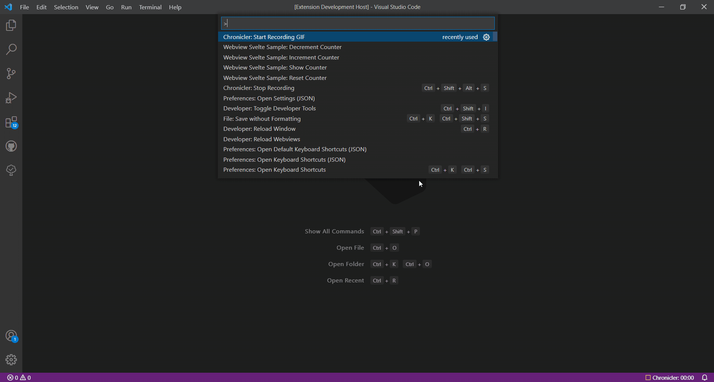

# vscode-webview-svelte-sample
VSCode webview sample created by Svelte.

# Demo

# Feature
 - Creating and showing webview by [Svelte](https://svelte.dev/).
 - Loading local contents.
 - Running script in webview.
 - Message passing between webview and extension.
 - Using a basic content security policy.
 - Saving and restoring state when the panel goes into the background.
 - Serialization and persistence across VS Code reboots.
 - Compiling ts/svelte/scss file and Outputting html/css/js file by webpack.
 - Styling according to VSCode theme.

# Running the sample
1. Open this sample
2. `npm install`
3. `npm run watch`
4. `F5` to start debugging
5. Run command `Webview Svelte Sample: Show Counter`

# Commands
 - `Webview Svelte Sample: Show Counter`
 - `Webview Svelte Sample: Increment Counter`
 - `Webview Svelte Sample: Decrement Counter`
 - `Webview Svelte Sample: Reset Counter`
